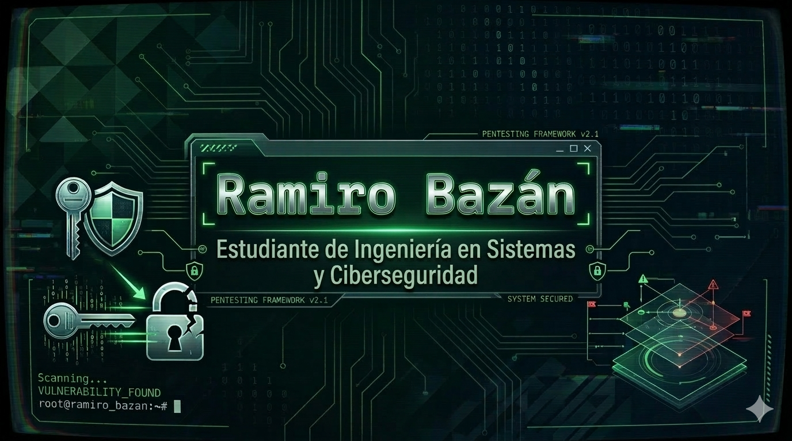

  

<h1 align="center">¡Hola! Soy Ramiro Bazán 👋</h1>

  <strong>🚀 Futuro Ingeniero en Sistemas | Entusiasta de la Ciberseguridad | Aspirante a Hacker Ético</strong>

  Estudiante de <b>Ingeniería en Sistemas de Información</b> en la <b>Universidad Tecnológica Nacional, Facultad Regional Córdoba (UTN FRC)</b>. Mi enfoque principal está en el desarrollo de software robusto, la infraestructura de servidores domésticos y mi meta final: el <b>Hacking Ético</b>.

<table>
  <tr>
    <td width="50%" valign="top">
      <h3>👤 Información Personal</h3>
      <ul>
        <li><b>Nombre completo:</b> Ramiro Bazán</li>
        <li><b>Fecha de nacimiento:</b> 13/08/2007</li>
        <li><b>Ubicación:</b> Córdoba, Argentina 🇦🇷</li>
        <li><b>Universidad:</b> UTN-FRC</li>
        <li><b>Carrera:</b> Ingeniería en Sistemas de Información</li>
      </ul>
    </td>
    <td width="50%" valign="top">
      <h3>📞 Contacto & Redes</h3>
      <ul>
        <li>📧 <b>Email:</b> <a href="mailto:ramirobazan2007@gmail.com">ramirobazan2007@gmail.com</a></li>
        <li>📱 <b>Teléfono:</b> +54 351 312-6670</li>
        <li>💼 <b>LinkedIn:</b> <a href="#">https://www.linkedin.com/in/ramiro-baz%C3%A1n-9917783b7/</a></li>
      </ul>
    </td>
  </tr>
</table>

<h3>🛠️ Stack Técnico & Herramientas</h3>

  <b>Lenguajes:</b> 
  <code>Python (CustomTkinter, C integration)</code>, <code>JavaScript</code>

  <b>Backend & DB:</b> 
  <code>Node.js</code>, <code>PostgreSQL</code>, <code>SQLite</code>

  <b>DevOps & Infra:</b> 
  <code>Docker</code>, <code>Orange Pi (NAS/SBC)</code>, <code>Networking</code>

  <b>Sistemas:</b> 
  <code>Linux</code>, <code>Server Environments</code>

<h3>🎯 Objetivos y Visión</h3>

  Actualmente me dedico a profundizar mis conocimientos en desarrollo <b>Fullstack</b> y arquitectura de sistemas, mientras construyo las bases técnicas necesarias para mi transición profesional hacia la <b>Ciberseguridad y el Pentesting</b>.

  

